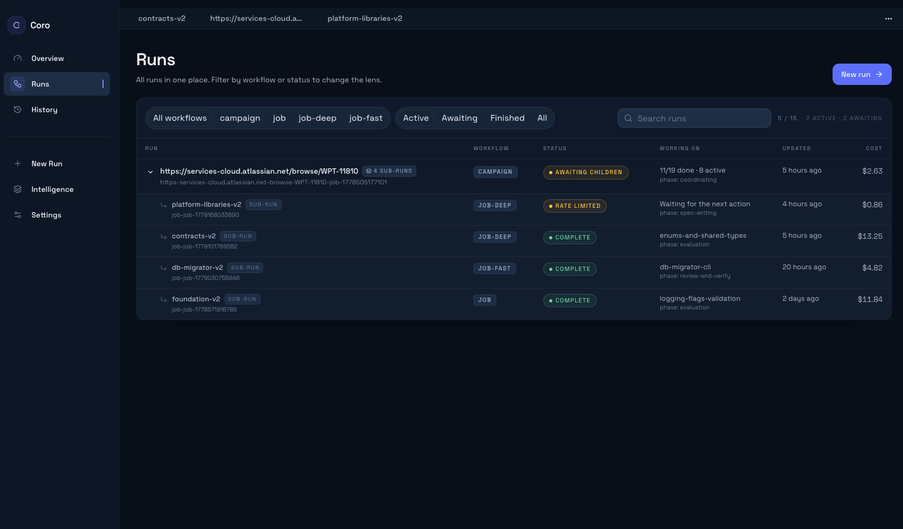

# Coro

## An open workflow harness for AI-assisted software delivery

Open-source workflow runner for the full **spec-to-merge** path on your codebases, with **layered markdown intelligence** and **review-gated self-improvement** so conventions and lessons accumulate in git—not in one-off threads. **Desktop app** for macOS and Windows; CLI for automation.

[](NOTICE.md)
[](https://github.com/Coro-ai-framework/coro-release/releases/latest)

**[Download (macOS)](https://github.com/Coro-ai-framework/coro-release/releases/latest)** · **[Download (Windows)](https://github.com/Coro-ai-framework/coro-release/releases/latest)** · [Documentation](docs/README.md) · [Contributing](CONTRIBUTING.md) · [License](NOTICE.md)

> **Pre-1.0.** APIs, workflows, and team/cloud features are still evolving. See [ROADMAP.md](ROADMAP.md).



---

## Quick start (desktop)

The **Coro desktop app** is the recommended way to run Coro. It bundles the runner and dashboard—no terminal required for day-to-day use.

### 1. Install

Download the latest release from **[Coro-ai-framework/coro-release](https://github.com/Coro-ai-framework/coro-release/releases/latest)**:

| Platform | File |
| -------- | ---- |
| **macOS** (Apple Silicon) | `Coro-*-arm64.dmg` (or `.zip`) |
| **Windows** (x64) | `Coro-*-x64.exe` |

Install and open **Coro**. The app starts a local runner in the background and opens the dashboard in a window.

### 2. Configure

On first launch, go to **Settings** and add:

- **Anthropic credentials** — API key, OAuth token, or Claude Code login
- **Git provider + access token** — GitHub, GitLab, or Bitbucket (clone repos and open PRs)
- **Working directory** and **intelligence directory** (defaults under `~/.coro/` are fine)

Settings are saved to `~/.coro/config.json`.

### 3. Run a job

Open **New Job**, choose a repository, and describe the change. Watch phases progress in the UI. When the workflow finishes, Coro opens a pull request on your target repo.

---

## Other ways to run Coro

| Method | Best for |
| ------ | -------- |
| **Desktop app** | Daily use on macOS and Windows |
| **Browser + local runner** | Linux, or hacking on Coro itself — see [docs/local-setup.md](docs/local-setup.md) |
| **CLI** | Scripts, CI, automation — requires a running runner ([CLI reference](#cli-reference)) |

### Browser + runner (developers)

From a built clone of this repository:

```bash
pnpm install && pnpm -r build
pnpm start    # or: node packages/runner/dist/cli/index.js start
```

Opens **http://localhost:3000/dashboard/** in your browser (suppressed in headless/SSH; use `--no-open` or `CORO_NO_OPEN=1`).

> **Contributors:** use `pnpm`, not `npm` — this is a pnpm workspace. See [CONTRIBUTING.md](CONTRIBUTING.md) and [docs/local-setup.md](docs/local-setup.md).

---

## How Coro works

Coro is **not an IDE and not a single chat agent**. Markdown files are the intelligence; TypeScript is the plumbing.

**Workflow phases** — A typical implementation job runs spec → plan → code (with an in-phase code reviewer) → merge coordination → evaluation on the merged result. Jobs **park** on external events (PR review, webhooks) and resume when the runner is notified.

**Layered intelligence** — Each job materialises overlays into `_intelligence/`:

```
┌─────────────────────────────────────────────────────────────┐
│ Repo overlay        <repoCheckout>/.coro/                   │
├─────────────────────────────────────────────────────────────┤
│ Tenant overlay      localDir | gitRemote | cloud            │
├─────────────────────────────────────────────────────────────┤
│ Base intelligence   @coro/intelligence-base/layer/          │
└─────────────────────────────────────────────────────────────┘
```

| Layer | What it carries |
| ----- | ---------------- |
| **Base** | Generic agents, workflows, skills (shipped with Coro) |
| **Tenant** | Team conventions, memory, service facts |
| **Repo** | Per-codebase overrides in `.coro/` |

**Review-gated self-improvement** — Agents record insights during runs; the evaluator can bundle vetted updates into `propose_change` PRs against your overlay (memory, skills, agent instructions). Nothing silently rewrites canonical behaviour.

Deeper tour: [docs/architecture-overview.md](docs/architecture-overview.md) · Monorepo engineering: [CLAUDE.md](CLAUDE.md)

---

## Plugin architecture

The runner is **provider-agnostic**. Anything that varies by Git host, issue tracker, or LLM is implemented as a **plugin** loaded at startup from `~/.coro/config.json` (and installable via `coro plugin install`).

| Kind | Role | Examples in this repo |
| ---- | ---- | --------------------- |
| **SCM** | Clone repos, open/update PRs, webhooks, merge polling | Built-in GitHub (`packages/runner/src/plugins/builtin/github/`); reference [`@coro/plugin-gitlab`](packages/plugin-gitlab/) |
| **Tracker** | Tickets, comments, transitions, job triggers | Built-in Jira (`packages/runner/src/plugins/builtin/jira/`) |
| **Executor** | Run workflow phases against an LLM (tools, sessions, models) | [`@coro/llm-anthropic`](packages/llm-anthropic/), [`@coro/llm-openai`](packages/llm-openai/) |

Workflow YAML can pin a provider per phase (`provider:` / model aliases). Jobs can override defaults with `set_job_params({ scm: 'gitlab', tracker: 'jira' })`.

**Contributing a new integration** — Implement a separate package that depends on [`@coro/plugin-sdk`](packages/plugin-sdk/):

- **SCM / tracker** — extend `ScmPluginBase` or `TrackerPluginBase`; ship `coro-plugin.json`, optional MCP server wiring, and optional `intelligence/` snippets for the overlay.
- **LLM** — extend `ExecutorPluginBase` and return a `PhaseExecutor` (see the Anthropic/OpenAI packages for the pattern).

Scaffold locally with `coro plugin init <id>`, or study [`packages/plugin-gitlab`](packages/plugin-gitlab/) as a full SCM example. SDK reference: [`packages/plugin-sdk/README.md`](packages/plugin-sdk/README.md). Extension contract notes: [`docs/workflow-extension-contract.md`](docs/workflow-extension-contract.md).

---

## Deployment shapes

| Mode | What runs where |
| ---- | ---------------- |
| **Solo** | Runner + dashboard + SQLite on your machine (desktop or local runner) |
| **Team (hybrid)** | Per-developer runner + shared cloud control plane (commercial; see [NOTICE.md](NOTICE.md)) |

---

## CLI reference

The CLI talks to a **running** runner (started by the desktop app or `coro start`). Useful for automation—not required for normal use.

| Command | Purpose |
| ------- | ------- |
| `coro start [--no-open] [--port N]` | Start runner + serve dashboard |
| `coro job --repo … --description …` | Submit a job |
| `coro jobs` / `coro status <id>` / `coro logs <id> --follow` | Inspect jobs |
| `coro resume <id>` / `coro message <id> <text>` | Control running jobs |
| `coro init` / `coro login` | Scripted setup / cloud pairing |

After `pnpm -r build`, the entrypoint is `packages/runner/dist/cli/index.js`. Run any command with `--help` for flags.

Config schema: [`packages/runner/src/config/local-config.ts`](packages/runner/src/config/local-config.ts) (`~/.coro/config.json`).

---

## Repository layout

```
packages/
├── desktop-electron/     ← macOS + Windows desktop app
├── runner/               ← CLI, job engine, MCP tools, REST server
├── dashboard/            ← React UI (embedded in desktop + served by runner)
├── intelligence-base/    ← Base agents, workflows, skills, memory templates
├── plugin-sdk/           ← SDK for SCM, tracker, and executor plugins
├── plugin-gitlab/        ← Reference SCM plugin (GitLab)
├── llm-anthropic/        ← Executor plugin (Claude Agent SDK)
├── llm-openai/           ← Executor plugin (OpenAI)
├── cloud-protocol/       ← Shared runner ↔ cloud protocol types
└── landing/              ← Marketing site

runner/src/plugins/builtin/   ← Built-in github (SCM) and jira (tracker)

packages/runner/src/cloud/   ← Commercial control plane (see NOTICE.md)
```

Generic intelligence lives only in `packages/intelligence-base/layer/`.

---

## Developing Coro

```bash
pnpm install && pnpm -r build
pnpm test && pnpm typecheck
```

| Task | Command |
| ---- | ------- |
| Run runner from source | `pnpm dev` |
| Run desktop from source | `pnpm --filter @coro/desktop-electron dev` |
| Work on a plugin | `pnpm --filter @coro/plugin-gitlab test` (or your package) · [`plugin-sdk` README](packages/plugin-sdk/README.md) |
| Package desktop | See [docs/desktop-packaging.md](docs/desktop-packaging.md) |

Full setup, hybrid/cloud, and troubleshooting: **[docs/local-setup.md](docs/local-setup.md)**.

---

## Community & license

- [Contributing](CONTRIBUTING.md) · [Code of conduct](CODE_OF_CONDUCT.md) · [Security](SECURITY.md)
- [ROADMAP.md](ROADMAP.md) · [NON-GOALS.md](NON-GOALS.md)
- **License:** [BUSL-1.1](LICENSE) (converts to Apache-2.0 on 2029-05-19) — see [NOTICE.md](NOTICE.md) for the open-core split
