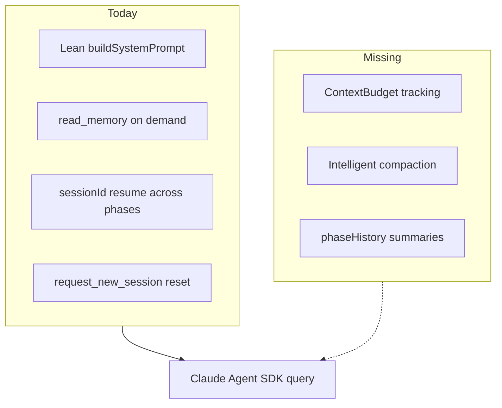
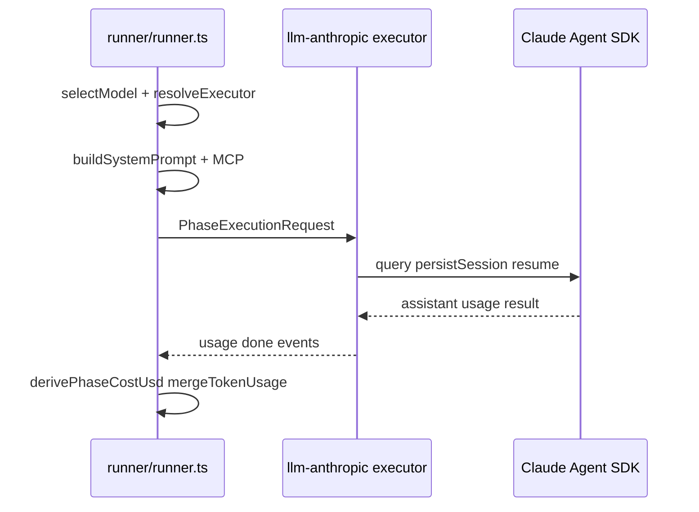
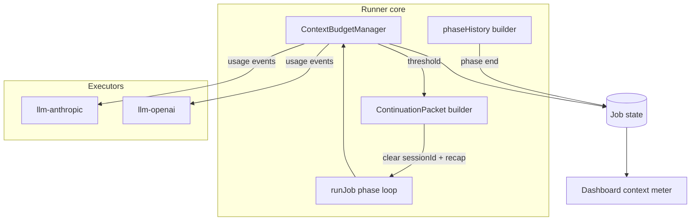

# Context compression analysis and integration plan

## Current state in Coro

### No runtime LLM context compression

There is **no** code that summarizes, prunes, or compacts the live conversation transcript. Context management today is **preventive** and **boundary-based**:

| Mechanism | Location | Effect |
|-----------|----------|--------|
| Lean system prompt | [`packages/runner/src/prompt/builder.ts`](packages/runner/src/prompt/builder.ts) | Workflow + agent + job JSON only; memory/skills via MCP |
| On-demand memory/skills | [`packages/intelligence-base/layer/.claude/CLAUDE.md`](packages/intelligence-base/layer/.claude/CLAUDE.md) | Agents call `read_memory` / `Skill` instead of pre-loading |
| Memory line budgets | [`packages/runner/src/tools/self-improvement.ts`](packages/runner/src/tools/self-improvement.ts) | Caps proposal size at write time |
| Memory curator workflow | `workflows/memory-curator/` | Offline grooming, not live transcript |
| `request_new_session` | [`packages/runner/src/mcp-handlers.ts`](packages/runner/src/mcp-handlers.ts) | Clears `sessionId` — blunt reset |
| Session resume (default) | [`packages/runner/src/jobs/runner.ts`](packages/runner/src/jobs/runner.ts) ~705–726 | **Accumulates** Claude Code transcript across phases |
| Subagent isolation | [`packages/runner/src/tools/run-subagent.ts`](packages/runner/src/tools/run-subagent.ts) | Fresh thread, `maxTurns: 16` |
| Tool output caps | `run_command` 64 KiB | Limits flood from shell output |

`ExecutorCapabilities.maxContextTokens` exists in [`packages/plugin-sdk/src/types.ts`](packages/plugin-sdk/src/types.ts) (line 433) but is **never enforced**. Model catalogs publish `contextTokens` ([`packages/llm-anthropic/src/executor.ts`](packages/llm-anthropic/src/executor.ts), [`packages/llm-openai/src/models.ts`](packages/llm-openai/src/models.ts)) for the dashboard picker only.

### Planned but not built

[`docs/plans/runner-core-provider-split-v1.md`](docs/plans/runner-core-provider-split-v1.md) defines the right **Coro-native** compression primitives:

- **`Job.phaseHistory[]`** — per-phase `summary` (≤1k chars), deterministic distillation from logs (no LLM)
- **`ContinuationPacket`** — capped `recap` + `phaseHistory` + artifacts for provider switches or hard resets
- Cross-provider continuity: same provider → `resumeSession`; different → `startFreshSession(packet)`

These types are **not** on [`packages/cloud-protocol/src/job-types.ts`](packages/cloud-protocol/src/job-types.ts) yet.



---

## LLM integration and execution flow



**Packages:**

- **`@coro/plugin-sdk`** — `PhaseExecutorRuntime`, `PhaseExecutorEvent`, `NormalizedTokenUsage`, `ExecutorModelDescriptor.contextTokens`
- **`@coro/llm-anthropic`** — wraps `query()`; `persistSession`, `resume`, `systemPromptCacheControl: ephemeral`, native subagents; maps SDK `usage` → runner events
- **`@coro/llm-openai`** — Responses API; full `conversationHistory` replay (no trimming); local `calculateOpenAiCostUsd`
- **`@coro/runner`** — orchestration only; zero direct Anthropic imports (CI-enforced)

**Context actually sent to the model (Anthropic path):**

1. Explicit `systemPrompt` (workflow + agent + job)
2. Native `.claude/CLAUDE.md` + skills via `settingSources: ['project']` (symlinked `_intelligence/.claude`)
3. Full session transcript when `resume: sessionId`
4. MCP tool definitions + tool results in-session
5. Subagents via SDK `agents` map

Coro does **not** see or control the internal transcript shape — only session id and per-turn `usage` snapshots.

---

## How costs are calculated today

| Provider | Cost source | Runner behavior |
|----------|-------------|-----------------|
| Anthropic | SDK `total_cost_usd` on `result` | [`derivePhaseCostUsd`](packages/runner/src/jobs/runner.ts) — fresh session: full cumulative; resumed session: subtract `prePhaseUsage.totalCostUsd` |
| OpenAI | `calculateOpenAiCostUsd` in executor | Emits `totalCostUsd` on each `usage` event |
| Job totals | `mergeTokenUsage(base, phase)` | Sums tokens + cost across phases |

**Stored on `Job`:** `tokenUsage`, `phaseUsage[]` ([`packages/cloud-protocol/src/job-types.ts`](packages/cloud-protocol/src/job-types.ts)) → SQLite JSON / Postgres columns / Redis.

**Dashboard:** [`JobDetail.tsx`](packages/dashboard/src/pages/JobDetail.tsx) `TokenUsagePanel` + `PhaseUsageTable` — input/output, cache hit rate, spend. **No context fill % or remaining tokens.**

**Gaps relevant to compression:**

- Token counts on resumed sessions are **session-cumulative** within an `executePhase` call (same pattern as cost); job-level merge **adds** phase snapshots — cost has delta logic, tokens do not consistently
- `run_subagent` MCP usage is logged but **not** rolled into `job.tokenUsage`
- Static `pricing` tables are preview-only; accounting trusts runtime `costUsd`

---

## Effective context compression approaches (2025–2026)

Ranked by fit for Coro’s architecture (agentic, multi-phase, Claude Code + optional OpenAI):

### 1. Provider-native compaction (highest fidelity when available)

**Anthropic Compaction API** (beta, 2026): server-side summarization when input exceeds a threshold; prior messages replaced by a `compaction` block. Best when Coro calls Messages/API directly.

**Constraint:** Coro’s primary path is **Claude Agent SDK / Claude Code**, not raw Messages API. Compaction must be validated against SDK support (likely **not** exposed today). Treat as **Phase 3** behind a capability flag `supportsNativeCompaction`.

### 2. Session boundaries + structured recap (best Coro fit — aligns with existing plan)

Already sketched in v1 plan:

- **Deterministic `phaseHistory.summary`** at phase end (cheap, no extra LLM call)
- **`ContinuationPacket.recap`** on forced reset or provider switch
- Agent-driven **`request_new_session`** at work-item boundaries (already in intelligence)

This is **anchored iterative compaction**: stable sections (job goal, AC, open artifacts) + rolling recap.

### 3. Selective retention / pruning (runner-controlled)

- Drop or summarize old tool outputs (biggest win in agent loops)
- Keep last N turns of assistant reasoning; retain tool results for files still being edited
- Hierarchical memory: hot state in prompt, cold state in `read_memory` / artifacts

### 4. Isolation (already partial)

- Subagents (`run_subagent`, native SDK subagents) — bounded side threads
- Phase boundaries with optional **no resume** (`CORO_DISABLE_SESSION_RESUME`, workflow flag)

### 5. Retrieval instead of stuffing

Coro already does this for memory/skills. Extend to **phase logs** and **artifacts** via MCP (`list_artifacts`, targeted `read_memory`) rather than transcript replay.

### 6. LLM summarization (expensive, use sparingly)

Full transcript summary via a cheap model at compaction time. Reserve for **critical** handoffs (cross-provider, pre-escalation) with strict token caps and human-visible recap in dashboard.

**What to avoid as primary strategy:** naive tail truncation (loses tool-result chains and “lost-in-the-middle” failures).

---

## Proposed integration: `ContextBudget` layer

Goal: expose **how full the context is** and drive **graded compaction** before hard failures or runaway cost.

### New types (`@coro/cloud-protocol` + `plugin-sdk`)

```ts
export interface ContextBudget {
  modelId: string
  contextLimitTokens: number      // from ExecutorModelDescriptor.contextTokens
  fillTokens: number              // best estimate of current prompt+history size
  remainingTokens: number
  fillRatio: number               // fillTokens / contextLimitTokens
  source: 'usage_snapshot' | 'estimated' | 'provider_reported'
  updatedAt: string
  compactionCount: number
  lastCompactionReason?: string
}
```

Extend `PhaseExecutorEvent`:

```ts
| { type: 'context'; budget: ContextBudget }
```

Optional on `PhaseUsage` and live `Job.contextBudget` for dashboard.

### Fill estimation (pragmatic v1)

**Primary signal:** latest `usage` event `inputTokens` from the executor (Anthropic reports per-request context size in practice). On resumed sessions, apply the **same delta pattern as `derivePhaseCostUsd`**:

```ts
fillTokens = max(0, latestInputTokens - baselineInputTokensAtPhaseStart)
```

**Secondary:** one-time `estimateSystemPromptTokens(systemPrompt)` via tiktoken/claude tokenizer (or chars/4 heuristic) added to fill when starting a **fresh** session.

**Ceiling:** `contextLimitTokens` from `executor.listModels()` for resolved `model`.

**Do not** use `job.tokenUsage.inputTokens` sum as fill — that double-counts across phases.

### Runner: `ContextBudgetManager`

New module: `packages/runner/src/context/budget.ts`

- Instantiated per phase in `runJob`
- Updated on each `usage` (and `context` if executor sends provider-native data later)
- Persists `job.contextBudget` every N turns (mirror token sync cadence)
- Threshold policy (configurable defaults):

| `fillRatio` | Action |
|-------------|--------|
| &lt; 0.70 | Normal |
| 0.70–0.85 | Inject steering via `developerInput`: “Context ~X% full; prefer `read_memory` over re-reading files; avoid large tool output.” |
| 0.85–0.95 | Suggest agent call `request_new_session` with reason; append `phaseHistory` snapshot if implemented |
| ≥ 0.95 | **Runner-initiated soft compact:** build `ContinuationPacket`, clear `sessionId`, prepend recap to next `userPrompt`; log `[context] compacted` |

### Compaction actions (phased)

**Phase A — Observability only (low risk)**

- Compute and persist `ContextBudget`
- MCP tool `get_context_budget` for agents
- Dashboard context meter on Job detail (bar: used / limit / remaining)
- Log line when crossing 70/85/95%

**Phase B — Structured compaction (medium risk, high value)**

- Implement `buildPhaseSummary(job, phaseLogs)` (deterministic, from v1 plan)
- Maintain `job.phaseHistory[]` at phase boundaries
- On soft compact: `ContinuationPacket` builder + session reset + kickoff with recap
- Workflow YAML opt-in: `session: per-phase | per-work-item | continuous` (default stays `continuous` for compat)

**Phase C — Transcript-aware pruning (OpenAI path first)**

- For `conversationHistory` executors: prune old tool results, cap history length before `executePhase`
- Subagent token cap = `remainingTokens / 2` (v2 plan already mentions this)

**Phase D — Provider-native**

- Anthropic compaction API when executor uses direct API or SDK exposes it
- Capability-gated in `ExecutorCapabilities`

### Intelligence updates

Add to base [`CLAUDE.md`](packages/intelligence-base/layer/.claude/CLAUDE.md):

- When `get_context_budget` shows `fillRatio > 0.7`, prefer targeted reads over bulk exploration
- Call `request_new_session` when starting a new work item **or** when budget &gt; 0.85
- After compaction, re-read `phaseHistory` / artifacts instead of assuming prior tool results are in context

### Cost coupling

Compaction should **reduce** `inputTokens` growth rate. Track metrics:

- `phaseUsage` before/after compaction event
- Optional `compactionSavedTokensEstimate` on `ContextBudget`

Dashboard: correlate context meter with spend curve per phase.

---

## Architecture after integration



---

## Implementation order (recommended)

1. **Types + `ContextBudgetManager` + usage-based fill** in runner; emit/persist on job; unit tests mirroring `derivePhaseCostUsd` delta semantics
2. **MCP `get_context_budget`** + dashboard meter
3. **`phaseHistory` deterministic summaries** at phase end (from v1 plan)
4. **`ContinuationPacket` + soft compact at 95%** with session reset
5. **OpenAI history pruning** + subagent budget caps
6. **Provider-native compaction** when SDK/API path is clear

---

## Key files to touch

| Area | Files |
|------|-------|
| Types | [`packages/cloud-protocol/src/job-types.ts`](packages/cloud-protocol/src/job-types.ts), [`packages/plugin-sdk/src/types.ts`](packages/plugin-sdk/src/types.ts) |
| Budget logic | new `packages/runner/src/context/budget.ts`, [`packages/runner/src/jobs/runner.ts`](packages/runner/src/jobs/runner.ts) |
| Continuation | new `packages/runner/src/context/continuation-packet.ts` (per v1 plan) |
| MCP | [`packages/runner/src/mcp-handlers.ts`](packages/runner/src/mcp-handlers.ts), [`packages/runner/src/mcp-server.ts`](packages/runner/src/mcp-server.ts) |
| Executors | [`packages/llm-anthropic/src/executor.ts`](packages/llm-anthropic/src/executor.ts), [`packages/llm-openai/src/executor.ts`](packages/llm-openai/src/executor.ts) |
| UI | [`packages/dashboard/src/pages/JobDetail.tsx`](packages/dashboard/src/pages/JobDetail.tsx) |
| Intelligence | [`packages/intelligence-base/layer/.claude/CLAUDE.md`](packages/intelligence-base/layer/.claude/CLAUDE.md) |
| Tests | [`packages/runner/tests/runner/runner.test.ts`](packages/runner/tests/runner/runner.test.ts) |

---

## Risks and open questions

1. **Claude Code opacity:** fill may be approximate until SDK exposes explicit context-window remaining; document confidence in `ContextBudget.source`.
2. **Resume semantics:** token delta logic must match cost delta logic to avoid false 95% triggers after phase 2.
3. **Compaction vs workflow design:** coding phases that rely on cross-phase session memory may regress if auto-compact is too aggressive — make thresholds and `session:` policy configurable.
4. **Subagent blind spot:** native subagent tokens may be inside SDK `modelUsage` but not drive parent `ContextBudget` until executor forwards them.

No blocking product decision is required to start **Phase A (observability)**; confirm whether default policy should auto-compact at 95% or only warn until Phase B is validated in production jobs.
