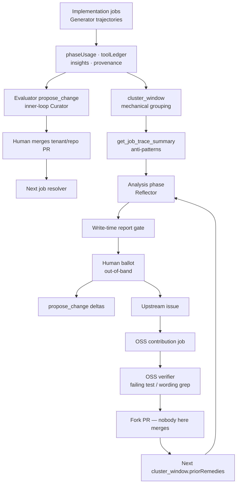

# Coro's Retrospective Self-Learning Loop

**Audience:** Engineers working on Coro, or anyone mapping the 2025–2026 self-evolving-agent literature onto this product.
**Status:** Describes the system as implemented, not as a wish list.

This document does three things:

1. Explains the research citations that shape Coro's self-improvement design (ACE, AHE, and the papers around them).
2. Describes Coro's architecture as the *substrate* those papers would call a harness / playbook — not a weight-update loop.
3. Walks the full self-learning cycle in execution order, calling out the concrete Coro features that instantiate each research claim.

The load-bearing product is the **retrospective**: a type-gated, human-gated, cross-job workflow that reads this install's own history and ships improvements as PRs. Per-job `add_insight` / `propose_change` is the inner loop. The retrospective is the outer loop. Together they are Coro's self-evolution mechanism.

---

## 1. Where Coro sits on the research map

[The What & When of Self-Evolving Agents](https://xinmingtu.github.io/blog/2026/self-evolving-agents/) sorts systems on two axes: **what is updated** (external files, the agent harness, or model weights) and **how long that update persists** (one session, across sessions, across users). Coro never updates model weights. It occupies two cells:

| Persistence | Substrate | Coro surface |
|---|---|---|
| Across sessions, one install | External files + harness | Tenant memory, tenant skills/agents, repo `.coro/` overlays. Next job on this machine reads the merged files. |
| Across users / installs | Harness | Upstream issues and fork PRs against the public Coro repository (`base-intelligence` and `runner-code`). Every other install's next upgrade inherits them. |

That is the “harness / playbook” cell of the map, not the “fine-tune from traces” cell. The TypeScript runner is a dumb tool shell. The intelligence is markdown. Self-improvement means **editing those files (and, when markdown cannot fix it, the runner that executes them)** under a human merge gate.

```text
  What evolves in Coro
  ─────────────────────────────────────────────────────────────
  External files     memory/*.md, .coro/memory/*.md
  Agent harness      agents/*.md, workflows/*/workflow.md,
                     .claude/CLAUDE.md, .claude/skills/*/SKILL.md
  Runtime harness    packages/runner TypeScript (tools, state,
                     phase loop, MCP surface)
  Model weights      never
```

A porous boundary the blog warns about is already how Coro works: a skill file is an external artifact at rest and harness logic the moment the resolver materialises it into `_intelligence/` and the SDK loads it. A runner-code fix is the same object one layer deeper — once merged, every future job routes through the new tool.

---

## 2. The citations, in their own terms

These papers do not describe Coro. They describe failure modes and mechanisms that Coro's retrospective was designed against. The rest of this document maps each claim onto a named Coro feature.

### 2.1 ACE — Agentic Context Engineering ([arxiv:2510.04618](https://arxiv.org/pdf/2510.04618), ICLR 2026)

**Claim.** Context adaptation beats weight updates for agents, but two failure modes kill it:

- **Brevity bias.** Prompt optimisers (GEPA, MIPROv2) collapse toward short, generic instructions and drop the domain heuristics agents actually need.
- **Context collapse.** Methods that *rewrite the whole context* each step eventually compress a rich playbook into a tiny summary. ACE's case study: 18,282 tokens / 66.7% accuracy → one rewrite later, 122 tokens / 57.1% — worse than no adaptation.

**Mechanism.** Treat context as an evolving **playbook**, not a prompt. Split labour across three roles:

| Role | Job |
|---|---|
| **Generator** | Run the task. Produce trajectories that surface strategies and pitfalls. |
| **Reflector** | Distill lessons from those traces. Do not also edit the playbook. |
| **Curator** | Turn lessons into compact **delta** entries. Merge them with non-LLM logic. |

Three design rules follow:

1. **Incremental delta updates.** Itemized bullets (id + helpful/harmful counters + content), not a monolithic rewrite. Localization, fine-grained retrieval, cheap merge.
2. **Grow-and-refine.** Append new bullets, update existing ones in place, de-duplicate. Context expands without erasing prior knowledge.
3. **Execution feedback is enough.** ACE works without labeled supervision when the environment returns a natural signal (code ran / failed). On finance benchmarks without that signal, both ACE and Dynamic Cheatsheet *degrade*.

Empirically ACE beats prompt-only baselines by ~10.6% on agents and ~8.6% on finance, with far lower adaptation latency, because it stops paying for full rewrites.

**What this implies for Coro.** Intelligence must accumulate as structured files, updates must be section-level patches, and the agent that mines traces must not be the agent that rewrites `coder.md`. Line-budgets on memory fight bloat; they also *are* the brevity bias ACE warns about if they become the only pressure.

### 2.2 AHE — Agentic Harness Engineering ([arxiv:2604.25850](https://arxiv.org/html/2604.25850v2))

**Claim.** Harness engineering (prompts, tools, middleware, memory) is now the main determinant of coding-agent performance, but automating it is bottlenecked by **observability, not by agent capability**. Prompt-only self-evolution (ACE, TF-GRPO in AHE's comparison) misses the components that actually carry the gain.

**Three observability pillars:**

| Pillar | Meaning |
|---|---|
| **Component observability** | Every editable harness piece is a file. Failure maps to a class (tool, middleware, skill, memory, prompt). Edits are revertible at file granularity. |
| **Experience observability** | Millions of trajectory tokens are useless as a dump. Distill them into a layered, drill-down corpus the evolution agent can consume. |
| **Decision observability** | Every edit ships with a **falsifiable prediction**. The next round scores it against task-level outcomes. Ineffective edits revert. |

AHE's ablation is the design rule Coro took most seriously: swapping in evolved **tools, middleware, or long-term memory** each improved pass@1 on its own; swapping in only the **system prompt regressed** (−2.3 pp). Gains that live in prose do not transfer; gains that live in tools and memory do.

AHE also documents **regression blindness**: the evolve agent is ~5× better than chance at predicting which tasks an edit will fix, and near-chance at predicting which tasks it will break. That is why AHE auto-rolls back failed manifests, and why a later round that does not re-measure is not a closed loop.

**What this implies for Coro.** Prefer `runner-code` (a tool, a state transition, a test) over a CLAUDE.md bandaid. Give the analyst clusters and trace skeletons, not transcripts. Attach a metric name and a baseline to every finding so the next retrospective can score the PR.

### 2.3 Progress mirage ([arxiv:2607.25152](https://arxiv.org/abs/2607.25152))

**Claim.** When a long-running agent grades its own work, it reports progress on every cycle. In a controlled testbed, a frontier agent claimed improvement in **all 54 cycles**; a world-state oracle showed **56% had a measured delta of zero or below**. The self-verdict gate degenerated into accept-all and eroded the best deployed state by 19%.

The strongest in-band judge — reading the full artifact, the diff, and its own verdict history — still accepted cycles of which 44% were real-world regressions and rejected 38% of real improvements. On a boundary task whose success *was* verifiable from the artifact itself, the mirage vanished. The cause is not judge quality. It is **what the evaluator is grounded in**.

For open-ended objectives whose success signal lives outside the transcript, out-of-band evaluation with real-world access is a structural requirement. Scaling the judge is not enough.

**What this implies for Coro.** The analyst must not be the sole judge of its findings. A human looking at the same metrics cannot fill that gap either. Need: mechanical clustering, a write-time schema gate, a test that fails on the base SHA and passes on the branch, and a later retrospective that scores the metric — not another LLM saying the PR looks good.

### 2.4 Sample more, reflect less ([arxiv:2607.28576](https://arxiv.org/abs/2607.28576))

**Claim.** At equal token cost, Self-Refine and Reflexion lose to repeated sampling. Spending tokens to reconsider an answer is a worse use of them than spending the same tokens on another attempt. Reflexion's unforced variant often **never retries**, because the model judges its first answer correct and the loop silently collapses into one chain of thought.

The actionable reading is not “reflection never helps.” It is: before you add a self-critique phase, ask whether those tokens would buy more evidence, more samples, or an external verifier.

**What this implies for Coro.** Do not add a “think harder about your findings” phase. Spend the analysis budget on traces, clustering, and verification. If a second pass exists, its job is to **disprove** claims (grep, test, schema), not to rewrite the report in a more confident voice.

### 2.5 TRAJEVAL ([arxiv:2603.24631](https://arxiv.org/abs/2603.24631)) and TraceProbe ([arxiv:2607.06184](https://arxiv.org/html/2607.06184v1))

**Claim.** Resolve-rate and phase-count hide the failure mode. Capable coding agents fail at **edit quality** and **coherence collapse**, not at localization: they reach the correct code and then overwrite or thrash it. TraceProbe's rule-based Insight module names single-trajectory anti-patterns (search loops, verification skips); its Converge module aligns a successful run with a failed sibling to show where they diverged. File-level choice is too coarse; function selection and completion behaviour localise the difference.

**What this implies for Coro.** Raw `coding` run counts are a coarse proxy — and Coro already learned they produce false findings, because `coding → review → coding` is the required path for every work item. Need per-run action summaries (search / read / edit / verify / revert) and cross-job clustering of anti-patterns, plus successful-vs-failed siblings as contrast.

### 2.6 SEAGym ([arxiv:2606.17546](https://arxiv.org/abs/2606.17546))

**Claim.** Self-evolution must be scored **over time**, not as a single task score. SEAGym treats harness updates as the object of study and evaluates them through complementary views: train batches, frozen update-validation, held-out in-distribution and out-of-distribution transfer, replay of old tasks, and cost. Frequent updates can overfit the last window; a useful intermediate snapshot can collapse later; a “better” harness can simply be more expensive.

**What this implies for Coro.** Treat each shipped PR as a harness snapshot. The next retrospective must ask: does the finding still fire? Did cost or rework move? Did we regress a previously-clean phase? An unscored prior PR is unverified, not done.

---

## 3. Coro architecture, as the loop uses it

A full package map lives in [architecture.md](architecture.md). This section is only the pieces the self-learning cycle touches.

### 3.1 Design rule

> **Markdown files are the intelligence. TypeScript is the tool shell.**

The runner (`packages/runner`) executes phases linearly, exposes MCP tools, persists `Job` state, and parks/resumes on events. It has no orchestration intelligence. Workflows, agents, skills, and memory are markdown. The LLM reads them, calls tools, and uses `goto_phase` to control flow.

That split is ACE's playbook and AHE's component observability in one stroke: the editable harness *is* the file tree, and the runtime that records experience is separate from the files it records about.

### 3.2 Layered intelligence

Per job, the intelligence resolver stacks three layers into `<workingDir>/<jobId>/_intelligence/`:

```text
┌─────────────────────────────────────────────────────────────┐
│ Repo overlay     <repoCheckout>/.coro/                      │
├─────────────────────────────────────────────────────────────┤
│ Tenant overlay   localDir | gitRemote | cloudBlob           │
├─────────────────────────────────────────────────────────────┤
│ Base layer       @coro-ai/intelligence-base/layer/          │
└─────────────────────────────────────────────────────────────┘
```

| Path | Merge | Why |
|---|---|---|
| `.claude/CLAUDE.md` | **append** with provenance banners | Tenants extend, never overwrite, base guidance. |
| `memory/**/*.md` | **append** with banners | Memory is cumulative. |
| Everything else (`agents/`, `workflows/`, skills, …) | **last-wins** replace | A tenant or repo can fully redefine an agent. |

Two write rules keep this from becoming an un-auditable self-modifying blob:

- The **base layer is never writable** from an install. Local `propose_change` can only target the tenant overlay or a repo `.coro/`. Fixes to generic agents/skills/runner code leave the machine as upstream issues + fork PRs.
- Proposal writes materialise against the **writable source clone**, never against the constructed `_intelligence/` tree. `_intelligence/` is a read view. Using it as a write source would bake merged overlays into a tenant PR.

At job start the runner also stamps **intelligence provenance** on the `Job`: runner version, base-layer version, and per-layer source + revision. Two jobs in a retrospective window may have run different agent markdown; without this stamp the analyst cannot tell.

### 3.3 A job as a Generator trajectory

An implementation job (`type: job`, `workflows/job/workflow.md`) is ACE's Generator. It is also AHE's rollout. What it persists is the experience corpus the outer loop later reads:

| Recorded on the job | Used later as |
|---|---|
| `phaseUsage[]` (tokens, cache, cost, duration, model, `attribution`, `parkReason`, `toolLedger`) | Phase aggregates, rework arithmetic, trace anti-patterns, predicted-metric scoring |
| `insights[]` (`add_insight` during the run) | Strongest clustering signal; evaluator ships approved ones as tenant/repo PRs |
| `workItems[]` with `loopCount` | Work-item rework threshold |
| `artifacts[]` | Plans, PR links, evaluation reports — titles in the job report; bodies on disk |
| `intelligenceProvenance` | “Which playbook did this job actually run?” |
| Logs | Last-resort drill-down (`get_job_log_excerpts`), never the grouping step |

`PhaseUsage.attribution` is one of `work-item` | `checkpoint-resume` | `rework`, stamped at append time (`packages/runner/src/jobs/phase-observability.ts`). Older jobs derive it. Derivation **undercounts** rework by design: one resume per (phase, work item) is allowed when the phase is an interactive checkpoint. A raw run count that ignores this is how a three-work-item job was once filed as a pathological coding loop.

The tool ledger is capped (64 entries) and stores **error class, not payload** — `EPERM`, `rate-limit`, `403`, not the command string that might contain a tenant path. Trace summaries are built from these structured fields so they rarely contain identifiers.

### 3.4 Two nested self-improvement loops

```text
  Inner loop (every implementation job)
    agents record insights ──► dashboard curation ──► Evaluator
         propose_change ──► tenant/repo PR ──► human merge
         ──► next job's resolver loads the merged files

  Outer loop (on-demand retrospective)
    cluster_window + traces ──► findings report ──► human ballot
         ──► propose_change (tenant) and/or
             upstream issue + OSS contribution job (base / runner)
         ──► next retrospective scores predictedMetric
```

The inner loop can only see the job it is in. It is the right place to capture “this build needs `CGO_ENABLED=0`.” It cannot notice “the coding phase loops on every Go job.” That is the retrospective's reason to exist.

A third, subtractive loop exists: the **memory curator** (`workflows/memory-curator/workflow.md`). Every other agent only appends to memory. The curator is the only agent allowed to overwrite or delete entries. It is ACE's grow-and-refine, run as its own workflow with a human checkpoint, so memory does not collapse into a rewrite of `coder.md` and also does not grow without bound.

---

## 4. The full cycle, in execution order

### 4.1 Experience is produced (Generator)

Ordinary jobs run. Agents follow procedures in `agents/*.md`, invoke skills on demand, and call `add_insight` when a trigger fires (3+ retries, >5 minutes on one op, a sandbox quirk, a workaround, a guess that lasted >2 turns). Insights start as `pending`. A human can approve, reject, or edit them from the dashboard Insights tab before the evaluator ships.

The evaluator (`agents/evaluator.md`) is the inner-loop Curator:

- It verifies the **merged** base branch (out-of-band: build/tests/acceptance, not a self-grade of the transcript).
- It grooms approved insights into **one** `propose_change` per writable layer. A second call for the same `(jobId, layer)` is rejected in code.
- Memory updates prefer structured `entries[]` (pitfall ≤ 8 lines, pattern ≤ 10 lines). The runner renders the canonical layout and enforces the caps mechanically.
- Agent/skill/workflow edits prefer `deltas[]` (`insert-after`, `replace-section`, `append`) against the current file in the writer clone — ACE incremental deltas, not a whole-file dump from a metrics context.

Nothing in this inner loop is allowed to merge. Humans merge. The next job's resolver pulls the change automatically.

### 4.2 A human starts a retrospective

There is no scheduler. A retrospective costs tokens and can produce public artefacts, so a person launches it from the dashboard or `coro retrospective run`.

Dispatch is centralised in `packages/runner/src/jobs/retrospective.ts` so CLI and dashboard produce identical jobs:

| Param | Default | Why it is not optional |
|---|---|---|
| `type` | `retrospective` | Type-gates every history and upstream tool. An implementation job cannot trawl the install. |
| `workflowPath` | `workflows/retrospective/workflow.md` | Two phases: `analysis` then `shipping`. |
| `params.jobWindow` | 25 (clamped 5–100) | How many recent implementation jobs to read. |
| `params.tiers` | tenant on; upstream off | Where an approved finding may travel. The analyst cannot widen this mid-run. |
| `params.interactive` | **always `true`** | Without it the analysis→shipping checkpoint silently does not park, and the run ships unreviewed. |

Two concurrent retrospectives are refused (409): they would analyse the same window and race to propose the same fixes. A run that asks for upstream tiers without `upstream.repoUrl` configured is refused at dispatch, not after a window's worth of tokens.

### 4.3 Analysis (Reflector)

The same agent file (`agents/retrospective-analyst.md`) runs both phases. The runner parks between them. Check `phase` to know which procedure applies. The analysis phase is ACE's Reflector and AHE's Agent Debugger: it produces candidates from distilled evidence. It does **not** call `propose_change`.

#### 4.3.1 Load prior art

1. Invoke the `retrospective-analysis` skill — thresholds, evidence bar, categories, finding cap. Do not invent them.
2. `list_jobs({ scope: "retrospective", limit: 5 })` and read prior `retrospective-outcome` artefacts. Already shipped or already rejected is off the table.
3. `list_proposals({ status: "pending" })`. A finding with a PR in flight is not a finding.

#### 4.3.2 Cluster mechanically, then drill down

`cluster_window` runs first. It is a retrospective-only tool (`assertRetrospectiveJob`). The LLM's job is to **name the behaviour and pick a layer**, not to invent the grouping from log tails. The tool returns:

| Bucket | What it groups |
|---|---|
| `errorClasses` | Normalised escalation messages and ledger error classes |
| `insights` | Repeated `add_insight` categories (`sandbox-quirk`, `toolchain-pitfall`, …) — the skill calls this the strongest signal |
| `toolFailures` | `toolName\|errorClass` keys from the ledger |
| `costOutliers` / `tokenOutliers` | Jobs ≥ 2× the **median** of the same `workflowPath` (median, not mean — one campaign distorts a mean) |
| `siblings` | Per-workflow succeeded vs failed job ids — TraceProbe's Converge idea |
| `priorRemedies` | Scorecard of the last few retrospectives' shipped findings (see §4.7) |

Then `list_jobs` for compact rows (status, cost, tokens, `reworkPhases`, `topFailedTool`). Then selective `get_job_report` / `get_job_trace_summary` for jobs the cluster named, plus a couple of clean siblings as contrast. `get_job_log_excerpts` is last-resort drill-down, not grouping.

This is AHE experience observability as a layered corpus, not a transcript dump:

```text
  cluster_window     window-level histograms and scorecard     (always)
  list_jobs          compact per-job rows                      (always)
  get_job_report     tokens, attribution, tool histogram,
                     provenance, insight list                  (named jobs)
  get_job_trace_summary   anti-pattern labels + ≤40 event skeleton
  get_job_log_excerpts    filtered 400-char lines              (one named failure)
```

A finding that was not visible in the cluster (or a trace follow-up) is a code review, not a retrospective finding. The two-job bar makes that mechanical.

#### 4.3.3 Trace anti-patterns (TRAJEVAL / TraceProbe)

`get_job_trace_summary` labels a job with rule-based anti-patterns from the tool ledger — Insight, not an LLM judge:

| Label | Trigger |
|---|---|
| `same-tool-fail` | One tool failed ≥ 3 times in a phase |
| `search-loop` | ≥ 12 consecutive search-tool calls |
| `verify-skip` | Coding phase wrote and never called a verify tool |
| `session-reset` | ≥ 2 session resets in one run (one is how a work item starts clean; two is the agent throwing away its own progress — TRAJEVAL's coherence collapse) |
| `zero-cost-park` | Zero-cost snapshot with a `parkReason` (a park, not a loop) |
| `cache-blowup` | Cache-read tokens > 2× input tokens |

Phase `reworkRuns` remains in the report, but it is no longer the only lens. The skill forbids building a rework claim out of `runs` alone.

#### 4.3.4 Form findings, then verify against code

Six signals, with thresholds in the skill: phase rework (≥ 30% of the window, min 2 jobs), escalation clusters (≥ 2 jobs, same root cause), recurring tool/build failures (same cluster key in ≥ 3 jobs), cost/turn outliers (≥ 2× median, attributed to a phase), work-item rework (`loopCount ≥ 3` on similar items in ≥ 2 jobs), repeated insights (high severity even at 2 jobs).

Every finding carries:

- `evidence[]` — ≥ 2 job ids, each with a concrete number. Exception: an **evidence-pipeline** defect (the report, ledger, or cluster schema itself is broken) may cite one job and must be `high`. That is the thermometer-is-wrong carve-out; without it the analyst cannot report that the data it reasons from is wrong.
- `counterEvidence[]` — jobs in the window that did **not** show it.
- `category` — `tenant-intelligence` | `base-intelligence` | `runner-code`. Prefer `runner-code` when a test can exist (AHE ablation).
- `verification` — `verified` after a grep, otherwise `hypothesis`.
- `predictedMetric` — `{ name, direction, baseline }` from a **closed vocabulary** the next run can compute (`coding.reworkRuns`, `insight:sandbox-quirk`, `toolFail:scm_clone_repo|EPERM`, …). An invented name is rejected at write time because it would score `unverifiable` next month.

One defect trips several of the six signals. The skill asks the analyst to merge or to declare `rootCause` / `deliveryGroup` / `independentOf`. The runner **refuses a report that leaves overlapping findings silent** (`packages/runner/src/tools/retrospective-report.ts`): same-category findings that share target paths, or that draw more than half their evidence from the same jobs, must say which shape they are. Arithmetic detects overlap; the model names the cause.

Then the analyst checks the claim against files — ACE/AHE “verify before you name the remedy,” and Coro's own history: the first documented miss was “`job-history.ts` does not persist per-run cost,” which was a guess about the code from a metrics view. The field was already there.

- Intelligence claims: grep `_intelligence/` (the merged tree this install actually ran). Map hits back to repo paths. A phrase that exists only below a tenant banner is a tenant finding.
- Runner / upstream claims: `upstream_checkout` snapshots **upstream's default branch** into `_upstream/` and **strips `.git`**. The snapshot is for checking, not branching. It is also how the analyst discovers that maintainers already fixed it.

Two rules keep this from becoming a code review: do not go looking for findings in the snapshot; do not write the fix there.

Empty retrospectives are success. Manufacturing findings poisons the signal for every future run. Cap is 5 findings, ranked by severity.

#### 4.3.5 Post the report; the runner validates it

`post_artifact({ kind: "retrospective-report", data: { findings: [...] } })` is what the dashboard renders as the ballot. A finding missing from `data` can never be approved, even if the markdown describes it.

Write-time validation refuses (and lists every problem in one message):

- no `id` / no `title` (would be dropped before the ballot)
- fewer than two evidence jobs without being a high-severity evidence-pipeline defect
- a `predictedMetric` name the scorer cannot compute
- a `rootCause` group split across categories or metrics
- overlapping findings with no declared relation

This is Progress-mirage / Sample-more: a mechanical gate, not a second LLM pass that “reflects on quality.”

The analyst logs a one-line summary and **stops**. It does not advance itself. The runner parks.

### 4.4 The human gate

`analysis` carries `interactive_checkpoint: true`. Combined with `params.interactive: true`, the runner parks the job in `awaiting-developer-input` **after** analysis completes and **before** `shipping` starts. Findings are drawn from real internal runs. The human decides which ones may leave the machine.

The dashboard renders `findings[]` as a per-finding ballot (`components/retrospective/findings-list.tsx`). Findings that share a `rootCause` share one switch: one defect, one decision. `composeApprovalMessage` turns the toggles into:

```text
Approved findings: finding-1, finding-3
Skipped findings: finding-2
Ship only the approved findings. …
```

That string is the existing approve button's payload (`POST /jobs/:id/message`), not a second approval path. `Dispatcher.sendMessage` records it as `Job.checkpointApproval` addressed to the phase being entered (`shipping`). `buildCheckpointApprovalBlock` leads that phase's kickoff with a `[DEVELOPER APPROVAL]` block. The runner clears it on consumption.

A CLI `coro message` that names no ids still means “all of it” — the analyst is written to read it that way. A shipping phase that starts with **no** approval block at all must `escalate`, not guess.

Tiers gate destination, not reporting. A finding whose destination is off is still on the ballot. Shipping the tool refuses, and the outcome records “not shipped” with the tier as the reason — which is how a developer learns a wider run was warranted.

### 4.5 Shipping (Curator)

The analyst re-reads its own report (`get_artifacts({ phase: "analysis" })` — prior-turn context may not have survived the park) and ships only approved ids.

#### Tenant-intelligence → `propose_change`

One call per writable layer. Prefer `deltas[]` for section-level markdown patches and `entries[]` for memory. Include the predicted metric in the PR rationale so a future retrospective can score it. Base is still not writable.

`propose_change` on a retrospective is additionally gated by the `tenant` tier (`assertTenantTierPermitted`). A run launched without it cannot smuggle a generic fix into the local overlay.

#### Base-intelligence and runner-code → issue, then dispatch

These belong to the upstream Coro repository. The retrospective has neither a writable checkout nor a review loop. Whole-file dumps from a metrics context produced bad PRs. So this path is **dispatch, don't write**.

For each root-cause group (one issue per group, not per symptom):

1. **Dedup.** `upstream_search`. The fingerprint is computed in code from category, target paths, and either `rootCause` or normalised title — never accepted from the model — and embedded in the issue body as `<!-- coro-retro:<hash> -->`. Two installs that independently hit the same defect converge on one issue. A `rootCause` takes the title's place so two symptoms match each other instead of filing twice.
2. **Report.** `upstream_create_issue` or `upstream_comment_issue`. Fail-closed sanitisation: `Sanitizer.findLeaks()` refuses any title/body that still carries a repo slug, org, ticket key, email, or tenant id. Aliases (`repo-A`, `ticket-ref-1`) are applied on the way in; leak-check is the way out. A leak cannot be unpublished.
3. **Fix.** After every approved finding that still needs a change has an issue, **one** `dispatch_improvement_job` with a structured briefing per item.

The briefing is a schema, not a hope. `description` still works as a fallback for in-flight turns; the child planner and verifier consume `briefing`:

| Field | Role |
|---|---|
| `behaviourNow` / `behaviourWanted` | What to change |
| `evidence` | Counts, not job ids (public text) |
| `targetPaths` + `revisionSha` + `verified` | File list checked at a named revision |
| `failingTest` | **Required** for `runner-code` — refuse dispatch otherwise |
| `neighbouringWording` | **Required** for `base-intelligence` |
| `outOfScope` | What the child must not touch |
| `predictedMetric` | Feeds the next retrospective's scorecard |
| `evidencePack` | Sanitised anti-patterns, tool failures, grep hits — the child sees none of the retrospective report otherwise |

Per-run caps (`upstream.maxIssuesPerRun`, `maxCodeJobsPerRun`) live in `job.params`, so a retried phase cannot reset its own budget. The charge lands before the API call.

The contribution identity is a property of **repositories**, not of job type (`config/contribution-credential.ts`). The git credential helper is a separate process and cannot read `job.params`; a rule derived from config reaches both the helper and the in-process GitHub plugin. Fork and upstream stay the same account.

### 4.6 The OSS contribution job (out-of-band implementer)

`workflows/oss-contribution/workflow.md` is not a generic job with the ending swapped. Dedicated agents (`oss-planner`, `oss-coder`, `oss-verifier`, `oss-contributor`) so a contribution cannot run campaign promotion, lane switching, or a merge-gatekeeper review. `epicAllowed: false`. `params.interactive: true` so the coding checkpoint actually parks — last look before the change becomes public.

```text
  planning  →  coding (+ code-reviewer subagent)  →  verification  →  contribution
       │              │                                  │                    │
       │              │                                  │                    └─ opens fork → upstream PR, stops
       │              │                                  └─ test / wording gate (fail closed)
       │              └─ implement on the fork
       └─ confirm defect still on synced default branch; one work item per rootCause;
          Deferred section for leftovers (do not escalate them — that ends the job)
```

Verification is the Progress-mirage gate. The OSS verifier's own agent file says so: it exists because agents grading their own diff accept no-improvement cycles. Its job is to **disprove** the preview.

- `runner-code`: the named test must fail on the base SHA and pass on the branch.
- `base-intelligence`: neighbouring wording present; leftover copies of the old instruction not still live.
- Diff grown past the findings (drive-by refactors, formatting churn) → `escalate`, do not open a PR.

`code-reviewer` stays. There is no second self-critique agent (Sample more, reflect less).

The contributor opens a **cross-repository** PR (branch on the fork, base on `params.upstreamRepo`) via `scm_create_pr` — not a provider-native GitHub tool, which would authenticate as the install's ordinary account. The PR body must include the predicted metric and what to revert if the next scorecard says `regressed`. The job **ends at PR open**. Nobody here can merge it. Maintainers do.

Coverage is derived at the completion boundary (`jobs/contribution-coverage.ts`), not reported by the agent. `params.findings` is what was dispatched; `findingIds` on `pr-link` artefacts is what a PR claims; the difference is raised as an escalation naming the issues that still need a job. A child may correctly ship a coupled subset and leave the rest. `childJobId` on a finding's outcome records which job was *asked*, not what shipped.

### 4.7 The next retrospective closes the loop (decision observability)

AHE's third pillar: every edit is a prediction, checked next round. SEAGym: score the harness snapshot over time.

`cluster_window.priorRemedies` loads the last few retrospectives' shipped findings and scores each `predictedMetric` against the **current** window:

| Score | Meaning |
|---|---|
| `gone` | Metric hit zero (`eliminate`) or fell hard |
| `reduced` | Moved in the predicted direction |
| `still-firing` | Baseline barely moved |
| `regressed` | Moved the wrong way (ACE-style context collapse: a skill amendment that made the prompt longer and the jobs worse) |
| `unverifiable` | No `predictedMetric`, no baseline, or a name the scorer cannot compute — **treat as unverified, not done** |

The analysis skill is explicit: `still-firing` / `regressed` means last month's PR did not work — re-open or rewrite, do not treat the old PR as done. `gone` / `reduced` — do not re-file. Seeing the remedy in `_upstream/` is **not** enough to clear a finding: the runs have to predate it, and it has to address the same mechanism.

That is how retrospectives compound instead of re-filing the same plausible story.



---

## 5. Citation → Coro feature (the matching surface)

Each row is a research claim and the Coro mechanism that instantiates it. Features that exist *because* of the paper's warning are marked as such; features Coro had independently that happen to match are marked as such.

### ACE — playbooks, roles, deltas, collapse

| ACE claim | Coro feature | How it matches |
|---|---|---|
| Contexts should be evolving playbooks, not terse prompts | Layered markdown: `agents/`, `workflows/`, `.claude/skills/`, `memory/`, `.claude/CLAUDE.md` | The harness the model reads is a file tree of strategies, not a single optimized system prompt. |
| Generator / Reflector / Curator split | Jobs generate trajectories; retrospective **analysis** reflects; **shipping** + Evaluator + memory curator curate | Same agent file runs analysis and shipping, but the runner **parks between them** and forbids `propose_change` in analysis. Inner-loop Evaluator is a separate curator for per-job insights. |
| Incremental delta updates, not monolithic rewrites | `propose_change` `deltas[]` (`insert-after`, `replace-section`, `append`); memory `entries[]` merged into the current source file | The writer clone is the merge target. `_intelligence/` is never the write source. Whole-file dumps from a metrics context were the failure this replaced. |
| Grow-and-refine; de-duplicate rather than rewrite | Memory curator workflow (subtractive, only agent allowed to overwrite memory); line budgets on pitfalls/patterns; append-only merge for `memory/*.md` | Curator is periodic refine. Evaluator is grow. Caps fight bloat; curator fights collapse. |
| Helpful / harmful counters on bullets | `predictedMetric` + `priorRemedies` scores (`still-firing` / `reduced` / `gone` / `regressed` / `unverifiable`) | Coarser than per-bullet counters: scored per finding/PR on the next window, not per memory line on the next task. Same idea: an edit that did not help is not knowledge. |
| Execution feedback without labels | Job status, test results, tool-ledger success/fail, escalations, cost | The retrospective never needs a labeled “this job was wrong.” The environment already said so. |
| Brevity bias as a failure mode | Memory line budgets (pitfall ≤ 8, pattern ≤ 10, skill section ≤ 15) **and** the skill's instruction that intelligence changes are section-level, not rewritten `coder.md` | Budgets are ACE's tension made concrete: they prevent collapse-by-verbosity and can cause collapse-by-brevity. The scorecard is how you notice the second. |
| Context collapse from full rewrites | Last-wins replace for agents/skills is the *capability* to collapse; deltas + “do not rewrite a whole agent file from a metrics context” + curator-as-the-only-overwrite-path are the *mitigation* | AHE's prompt-only regression is the same warning: a longer CLAUDE.md that leaves the bug live scores `still-firing`. |

### AHE — three pillars, prefer tools over prompts

| AHE claim | Coro feature | How it matches |
|---|---|---|
| Component observability (file-level harness) | One file per agent, skill, workflow, memory topic; runner modules mapped in the analysis skill (`job-history.ts`, `job-trace.ts`, `phase-observability.ts`, …) | A finding's `category` + `targetPaths` *is* the action space. `runner-code` vs `base-intelligence` vs `tenant-intelligence` is AHE's component class. |
| Experience observability (layered drill-down, not raw traces) | `cluster_window` → `list_jobs` → `get_job_report` → `get_job_trace_summary` → `get_job_log_excerpts` | Explicitly built so the analyst does not dump transcripts. Event skeleton capped at 40. Ledger stores error *class*. |
| Decision observability (falsifiable prediction, next-round verify) | Required `predictedMetric` on every finding; closed vocabulary the scorer can compute; `cluster_window.priorRemedies` | AHE's change manifest, persisted on the finding rather than a separate file, verified on the next retrospective rather than the next Terminal-Bench iteration. |
| Ablation: tools / middleware / memory carry the gain; system prompt alone regresses | Skill default: if a tool error, state transition, or missing capability is involved → **`runner-code` first, with a test**. Intelligence changes are procedure gaps, section-level. | Direct policy transfer. A markdown bandaid that leaves the bug live is predicted to score `still-firing`. |
| Distill millions of tokens; keep raw traces for drill-down | Tool ledger (64 entries, no payloads) + anti-pattern labels; log excerpts as last resort | Matches AHE's “reports first, original traces available to verify claims.” |
| File-level revert | Git PRs against tenant overlay, repo `.coro/`, or upstream. Humans merge. Next scorecard says what to revert | AHE auto-rolls back; Coro does not — the human ballot and the next scorecard are the revert path. The OSS PR body is required to say what to revert if the metric regresses. |
| Regression blindness | Scorecard includes `regressed`; OSS verifier + contribution-coverage catch shipping failures AHE's evolve agent would miss | Coro does not claim to predict regressions at edit time. It measures them next window. |

### Progress mirage — out-of-band gates

| Claim | Coro feature | How it matches |
|---|---|---|
| Self-evaluation accepts ~56% of no-improvement cycles | OSS verifier agent: “You do not write features. You check that the coder's claim is true… **disprove** the preview if you can.” | Separate phase, separate agent, grounded in test exit codes / greps, not in the coding transcript. |
| In-band judges fail even with the full diff | Evaluator runs build/tests on the **merged** commit; OSS verifier runs the named test on **base SHA vs branch** | Success signal lives in the world (process exit, assertion) outside the transcript. |
| Humans looking at the same metrics cannot fill the gap | Ballot is necessary and **not sufficient**. Schema gate, two-job bar, `verified` vs `hypothesis`, failing-test requirement, next-window scorecard | The human decides *permission to leave the machine*. The world decides *whether it worked*. |
| Artifact-verifiable tasks have no mirage | `base-intelligence` wording grep (neighbouring phrase present, old copies gone) is the artifact-verifiable boundary task; `runner-code` is the world-state task | Two different grounds, both out-of-band. |
| Forced feedback of rejection | `priorRemedies` is prepended to the next analysis; `unverifiable` is not treated as success; contribution-coverage escalates leftovers | The next Reflector is programmatically handed last round's verdict. |

### Sample more, reflect less — no extra self-critique loop

| Claim | Coro feature | How it matches |
|---|---|---|
| Extra self-critique loses to better evidence at equal token cost | Two-phase retrospective. No “reflect on your findings” phase. Tokens go to `cluster_window` and traces | Explicit non-feature. |
| Reflexion often never retries because it judges itself correct | Analysis cannot ship. Shipping without `[DEVELOPER APPROVAL]` escalates. OSS verifier fail-closes | The loop cannot silently become one pass that declares itself done. |
| If you add a second pass, ground it externally | Write-time report validation (schema, overlap, metric vocabulary); grep against `_intelligence/` and `_upstream/`; OSS test gate | The second pass is a checker, not a rewriter. |

### TRAJEVAL / TraceProbe — trajectories, not aggregates

| Claim | Coro feature | How it matches |
|---|---|---|
| Resolve-rate / phase-count hide failure mode | `reworkRuns` after subtracting work-item and checkpoint-resume runs; `phaseRuns[]` with recorded `attribution` and `parkReason` | The false finding “six coding runs on a three-work-item job” is the thing this arithmetic exists to stop. |
| Coherence collapse (reach correct code, then thrash it) | `session-reset` anti-pattern (≥ 2 resets in one run) | Named in `job-trace.ts` as “the agent throwing away its own progress — the coherence collapse that phase counts cannot show.” |
| Search loops, verification skips | `search-loop`, `verify-skip`, `same-tool-fail` labels | Rule-based Insight module. |
| Converge: successful vs failed siblings | `cluster_window.siblings` per `workflowPath` | Contrast set, not just the failing jobs. |
| Function-level, not file-level | Analysis skill: name the function inside `targetPaths`; grep the symbol, read the function around it | The fingerprint uses paths; the briefing is supposed to name the function. File-only lists are how duplicates fail to match across installs. |

### SEAGym — score evolution over time

| Claim | Coro feature | How it matches |
|---|---|---|
| Held-out transfer, not just the last window | Next retrospective's window is a new batch of jobs. `priorRemedies` asks whether the finding still fires on **new** runs | No frozen ID/OOD split (this is production, not a benchmark), but the next window is held-out in time. |
| Replay / regression of earlier behaviour | `regressed` score; “jobs that hit the behaviour *after* a remedy was in place make the finding stronger” | Explicitly forbids clearing a finding because the fix *looks* present in `main`. |
| Cost trajectory | `reworkCostUsd`, cost/token outliers vs per-workflow median, `costUsd` as a first-class predicted metric | A cheaper-looking prompt that burns cache (`cache-blowup`) is visible. |
| Frequent updates overfit the last window | Finding cap of 5; empty retrospective is success; don't re-file `gone`/`reduced`; one PR per layer per job | Pressure against churn. |
| Snapshot the harness | `intelligenceProvenance` on every job; `upstream_checkout` of **upstream main**, not the installed version | Two jobs in the window may have run different markdown. A finding's remedy is checked against what a PR would change, not against what this laptop happened to have installed. |

### What & When — substrate × horizon

| Cell | Coro |
|---|---|
| Across sessions × external files | Tenant `memory/*.md`, repo `.coro/memory/`. Inner-loop Evaluator + outer-loop tenant findings. |
| Across sessions × harness | Tenant/repo overlays of agents, skills, workflows, CLAUDE.md. |
| Across users × harness (platform flywheel) | `upstream_create_issue` + `dispatch_improvement_job` → fork PR. Fingerprint dedup so independent installs converge. |
| Across users × files | Base-layer markdown in the same upstream PR as runner code when they are one story. |
| Weights, any horizon | Empty. Recursive self-improvement here means “the install files PRs against the project that runs it,” not “the model fine-tunes itself.” |

---

## 6. Properties the papers do not require, and Coro treats as load-bearing

These are not in ACE or AHE. They exist because a self-improving loop that reads **this company's jobs** and can write **a public repository** has failure modes a Terminal-Bench evolver does not.

| Property | Why |
|---|---|
| **Type-gated tools** | History, cluster, trace, and upstream tools throw unless `job.type === retrospective`. An implementation job records `add_insight`; it cannot trawl. |
| **Sanitise by default, refuse leaks on the way out** | Reports use aliases. Publishing runs `findLeaks()`. A leak cannot be deleted from GitHub. |
| **Human ballot before anything public** | ACE merges deltas with non-LLM logic; AHE runs unattended and rolls back. Coro parks. Findings are internal evidence. Shipping is a permission. |
| **Tiers chosen at launch, enforced in code** | The analyst cannot widen `params.tiers`. `propose_change` and every `upstream_*` tool re-read them. |
| **Dispatch, don't write, for upstream** | The retrospective's context is clustered metrics. The child job's context is a fork and a briefing. Mixing them produced whole-file dumps. |
| **Fingerprint computed in code** | Dedup that accepted a model-supplied hash would not converge across installs. |
| **Caps in `job.params`** | A retried shipping phase must not get a fresh issue budget. |
| **Contribution credential keyed by repository** | The git helper never sees `job.params`. Identity has to be a property of the fork/upstream pair. |
| **Coverage derived at completion** | An agent that must remember to report leftovers will forget. `params.findings` − `pr-link.findingIds` is the remainder. |
| **Base layer never writable from the install** | Local self-improvement cannot silently change how every tenant's agents behave. That path is a public PR. |

---

## 7. Inner loop vs outer loop vs research roles

Putting the ACE roles on Coro's actual agents, because “the retrospective analyst is the Reflector” is only half the picture:

| ACE / AHE role | Inner loop (one job) | Outer loop (many jobs) |
|---|---|---|
| Generator / Code Agent | Planner, coder, reviewer, evaluator running a product change | The install's past jobs, already persisted |
| Reflector / Agent Debugger | `add_insight` at the moment of the workaround (lossy, per-job) | Retrospective analysis: `cluster_window` + traces + code grep |
| Curator / Evolve Agent | Evaluator `propose_change` (tenant/repo only) | Shipping: `propose_change` and/or `dispatch_improvement_job` |
| Out-of-band verifier | Evaluator tests on merged commit | OSS verifier (pre-PR); next retrospective scorecard (post-merge, over time) |
| Human | Insights tab + merge of proposal PRs | Findings ballot + merge of tenant PRs + upstream maintainers |

AHE's Evolve Agent edits the harness autonomously and rolls back. Coro's Curator proposes; three different humans (install developer, then possibly an upstream maintainer) merge. That is slower. It is also the remaining out-of-band judge until scorecards have a history, and it is why a self-improving loop that has read tenant jobs does not drift the public product on its own.

---

## 8. Key source files

| Concern | Where |
|---|---|
| Workflow (phases, checkpoint, routing table) | `packages/intelligence-base/layer/workflows/retrospective/workflow.md` |
| Analyst procedures | `packages/intelligence-base/layer/agents/retrospective-analyst.md` |
| Thresholds, categories, metric vocabulary, verify-before-name | `packages/intelligence-base/layer/.claude/skills/retrospective-analysis/SKILL.md` |
| Proposal types, deltas, memory budgets | `packages/intelligence-base/layer/.claude/skills/self-improvement-guide/SKILL.md` |
| Inner-loop curator | `packages/intelligence-base/layer/agents/evaluator.md` |
| Grow-and-refine of memory | `packages/intelligence-base/layer/workflows/memory-curator/workflow.md` |
| OSS child workflow | `packages/intelligence-base/layer/workflows/oss-contribution/workflow.md` |
| Dispatch shape, finding/outcome types | `packages/runner/src/jobs/retrospective.ts` |
| Report write-time gate | `packages/runner/src/tools/retrospective-report.ts` |
| `list_jobs` / `get_job_report` / log excerpts | `packages/runner/src/tools/job-history.ts` |
| `cluster_window` / traces / prior-remedy scores | `packages/runner/src/tools/job-trace.ts` |
| Phase snapshots, ledger, attribution | `packages/runner/src/jobs/phase-observability.ts` |
| Type gate | `packages/runner/src/tools/retrospective.ts` |
| Sanitiser | `packages/runner/src/tools/sanitize.ts` |
| Upstream search/issue/dispatch | `packages/runner/src/tools/upstream.ts` |
| Read-only upstream snapshot | `packages/runner/src/tools/upstream-source.ts` |
| `propose_change` | `packages/runner/src/tools/self-improvement.ts` |
| Child job briefing | `packages/runner/src/jobs/oss-contribution.ts` |
| Leftover-finding escalation | `packages/runner/src/jobs/contribution-coverage.ts` |
| Ballot UI | `packages/dashboard/src/components/retrospective/findings-list.tsx` |
| Approval message | `packages/dashboard/src/lib/retrospective.ts` |

---

## 9. One-sentence summary

Coro self-improves by treating markdown (and, when markdown cannot, runner TypeScript) as an ACE playbook, instrumenting every job as an AHE evidence corpus, forbidding the Reflector from being its own Curator, refusing in-band self-grades in favour of tests and next-window metric replay, and putting a human — plus fail-closed sanitisation — on the only path from “this install's history” to “a public PR.”
